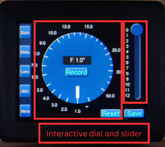
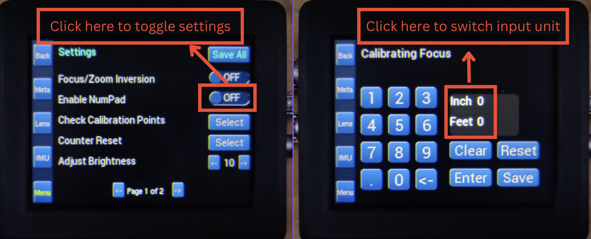

# MagicBox User Manual

**Firmware Version:** v1.0
**Document Version:** v1.0  
**Last Updated:** 08/07/2025

---

## Introduction

The MagicBox (also known as the Magic Shot Box) is the next generation in metadata technology, designed and manufactured in-house at Optical Support. It is a compact, all-in-one control system that streamlines the gathering, recording, and distribution of critical metadata—including lens values, camera orientation, and position—within a single, independent unit.

Traditionally, collating metadata on set has been a challenging process due to the multitude of information sources. MagicBox solves this by synchronizing multiple input streams independently, each with dedicated processing, resulting in clean, consistent, and reliable data gathering. The system supports accurate frame-by-frame recording of all metadata, with the ability to record on independent streams directly into camera raw footage and onboard to dual micro SD cards.

At the heart of MagicBox is a custom-built operating system, featuring an intuitive GUI and an accompanying iOS app for seamless access and control. This allows users to easily adjust preferences, perform lens mapping, and manage calibration profiles without the need for external sources. The iOS app further enables effortless sharing of lens mapping data between users, eliminating inconsistencies and ensuring that each lens and its designated camera are always in sync.

This manual provides a complete guide to setting up, operating, and maintaining your MagicBox unit, including feature walkthroughs and troubleshooting steps

---

## Getting Started

---
### Unboxing and Setup

Inside the MagicBox package, you should find:

- 1× MagicBox unit  
- 1× RS cable (3 pins)
- 1× TimeCode cable (5 pins)
- 1× Arri L-Bus cable (4 pins)
- 1× Sony L-Bus cable (3 pins)
- 1× Motor Data cable (7 pins)
- 1× Preston MDR junction box 
- 1× Quick Start Guide  
- (Optional) Mounting brackets (if ordered)

To power on MagicBox:
1. Power on your camera and plug RS, TimeCode and L-Bus cable for the camera and MagicBox.
2. Power on your Preston MDR kit and plug in the junction box with all the cables indicated.
3. The screen will light up and the system will boot within 5 seconds.
4. You will be greeted with the "Optical Support" first and then asked to select from the available camera modes.
5. Once selected the system will automatically calibrate itself to the L-Bus connection
6. All set, you will be able to see all the metadata available on the home page now.

---

### Wi-Fi Connection to iOS

To connect MagicBox with our designated iOS app:

1. Power on your MagicBox unit as usual
2. The device will enter Access Point (AP) mode with an SSID like `MagicBox_XXXX`  
3. On your iOS device, join the MagicBox Wi-Fi  
4. Open the iOS app and you can now send/receive data wirelessly

---

### Navigating the Interface

MagicBox features a fully touchscreen-based interface. Tap the side navigation bar icons to enter key modules:

- **Back** – Return to the previous page  
- **Meta** – Metadata: displaying majority of the data info  
- **Lens** – Lens Library: manage and select saved lenses  
- **IMU** – IMU sensor: displaying the IMU data and management
- **Settings** – User settings menu: modify various settings for the MagicBox

---

### Initial Lens Setup (Quick Example)

To add your first lens:

1. Tap **Lens Library**  
2. Press **"+" Add New**  
3. Enter the brand, model, and serial number  
4. Go back to **Meta** page and click Focus, Iris or Zoom to enter calibration page  
5. Save the lens profile when complete

Each lens is stored in the internal library and can be edited, deleted, or exported later.

  
  

Or if you prefer to use an old-fashioned number pad, you can navigate to the settings menu and toggle it on then repeat the same process above:

You will then be able to calibrate your lens, starting at any point you prefer. The number of calibration points is up to you, but bear in mind: the more points you use during calibration, the more accurate your metadata will be.

---
### Calibrate your first Lens (using iOS app)

To perform a lens calibration using the MagicBox iOS app:

1. **Connect your iOS device** to the MagicBox Wi-Fi network as described above.
2. **Open the MagicBox iOS app.** Ensure your device is connected and click the **Refresh** button on the top right. 
3. Tap the **Lens** tab at the bottom of the app interface.
4. Press **"+ Add New Lens"** and enter the lens brand, model, and serial number.
5. Select the lens you just created from the list.
6. Tap the **Hamburg** button on the top left and navigate to **Calibrate** page to begin the calibration process.
7. Follow the on-screen instructions to move the lens through its full range for Focus, Iris, and Zoom (if applicable). The app will prompt you to set calibration points at key positions.
8. When finished, tap **Save**. The calibration data will be stored both on the MagicBox and in the app.
9. You can now go back to the **Lens Table** page and set the lens active.

>- *Tip1:* For best results, use as many calibration points as possible, especially for lenses with non-linear focus or zoom curves.
>- *Tip2:* Make sure you have **at least one entry** ready on the MagicBox itself.
>- *Tip3:* Tap the **Keyboard** button on the top right if FIZ values are not provided in the dial page.

---
### L-Bus Connection (Arri Example)

To link your **MagicBox** to an **Arri camera**, follow the steps below:

1. **Power on your camera** and plug the corresponding cable to MagicBox.
2. **Disable** the **Lens Mount** in the settings menu under **Lens & ECS**. (See the top left image)
3. Select the model on MagicBox (you can also switch camera models during runtime by clicking the name).
4. The camera will display an orange **"CAL"** indicator and soon turn into black, which means MagicBox is automatically connecting itself to your camera (Bottom two images).
5. Once the connection is established (usually within a few seconds), navigate to **Settings → Info → Lens Info** (Top right).

---
### Metadata recording

To record the metadata that MagicBox is capturing, please follow the instructions below:

1. Navigate to the **Meta** page on MagicBox
2. Make sure you have a SD card inserted in the slot underneath MagicBox
3. Press **REC** on your camera
4. The display will synchronously show a red sign of **"Recording"**
5. Press **REC** again whenever you are done with this session
6. Now you can safely removed the SD card from MagicBox by clicking it and insert it to any compatitable card reader on your laptop
7. The session recorded will be named after the **TimeCode** whenever you started the recording, click and open the file you will then be able to see the medadata recorded in every single frame, as illustrated below.

---
### Exporting a Calibrated Lens Profile

To export a meticulously calibrated lens profile, please proceed as follows:

1. Navigate to the **Lens Table** page and designate the desired lens as active.
2. Execute long-press upon the entry until an options window appears.
3. Select **Inspect** to enter the detailed lens overview.
4. Within the inspection interface, locate and press the **Export** command on the upper right corner.
5. Choose **Export as JSON file** to save your lens info in .JSON format locally on your phone.

>- *Tip:* To import this lens, use the same **+** button on **Lens Table** page, but this time select **Import from local file**
